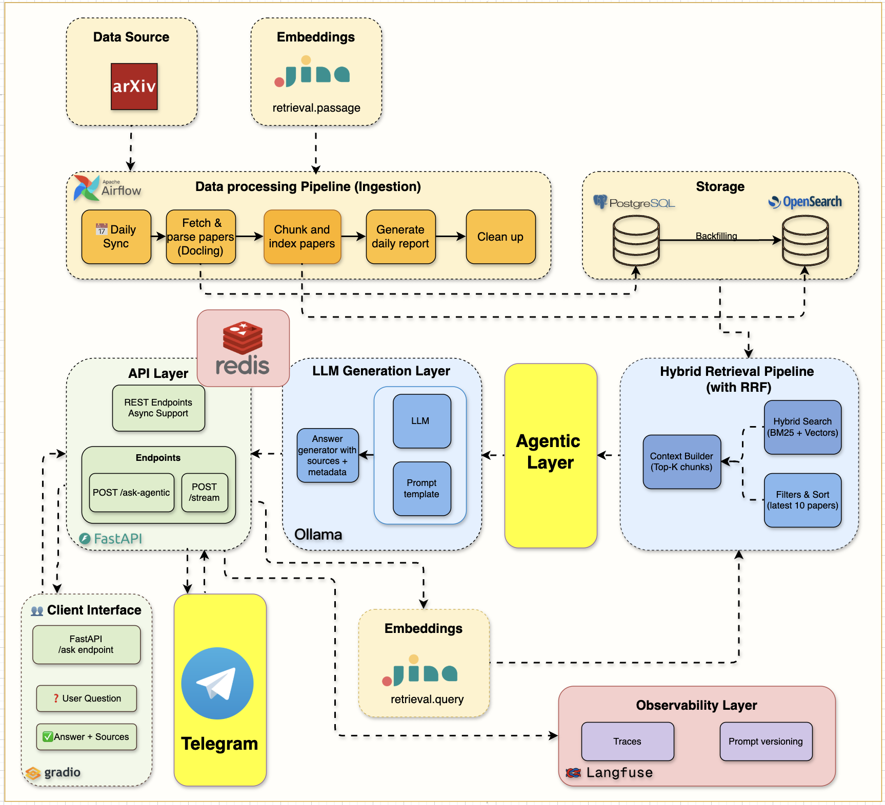
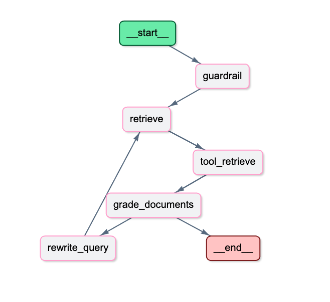
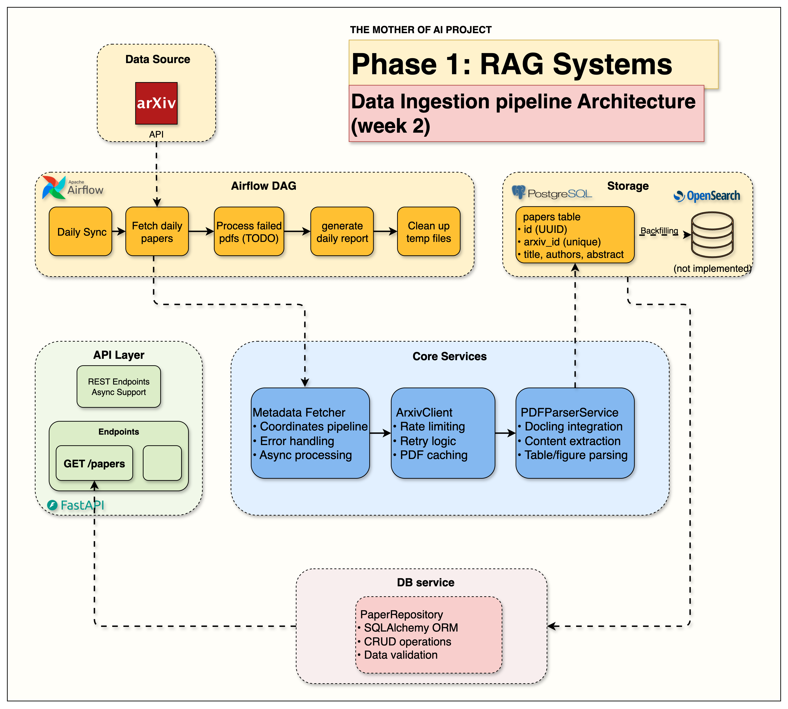
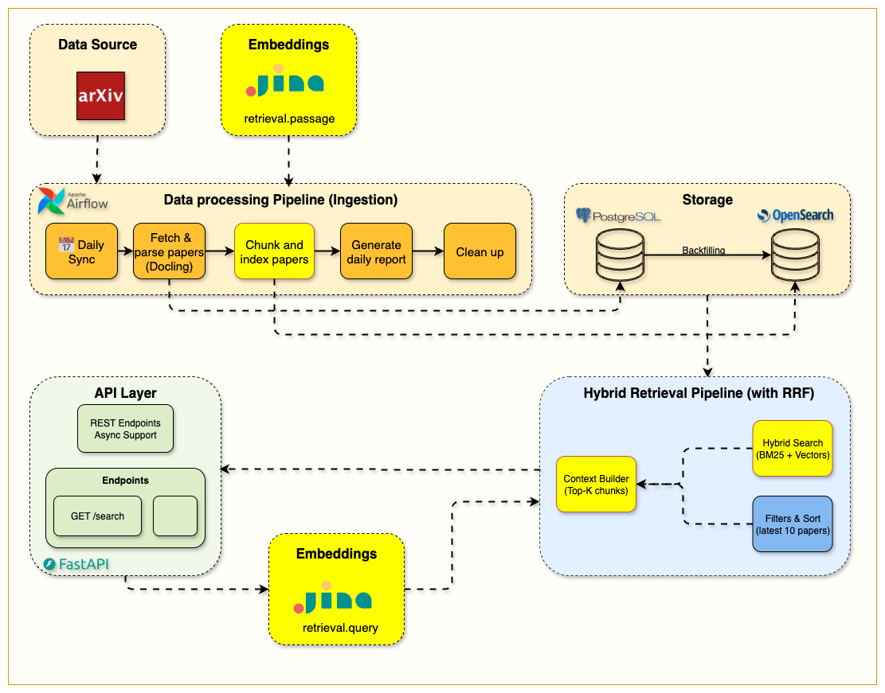
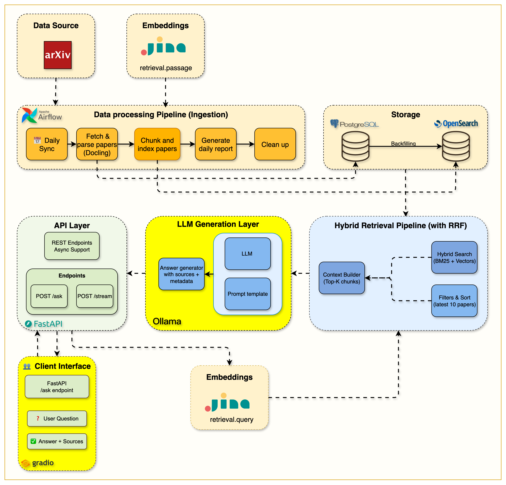

# Falco — Agentic RAG for Academic Research

<div align="center">
  <p><strong>End-to-end academic RAG with hybrid retrieval, local LLMs, observability, and an adaptive LangGraph workflow.</strong></p>

  
  
  
  
  
</div>

<br>

<p align="center">
  
</p>

Falco is an end-to-end Retrieval-Augmented Generation system for academic research. It ingests arXiv papers, parses and stores source documents, builds a chunk-level hybrid search index, and serves search, conventional RAG, streaming RAG, and adaptive Agentic RAG APIs.

The runtime is intentionally split into two paths:

- **Offline ingestion/indexing:** arXiv → PDF parsing → PostgreSQL → chunking → embeddings → OpenSearch.
- **Online serving:** FastAPI → search/RAG/Agentic RAG → OpenSearch/Jina/Ollama, with Redis and Langfuse around the request flow.

PostgreSQL is the canonical paper store. OpenSearch is the retrieval/read model. Ollama runs the local LLM. Jina generates retrieval embeddings. Redis provides exact-response caching and shared Agentic conversation history. Airflow schedules ingestion. Langfuse provides tracing and feedback.

## Architecture

```text
                                  OFFLINE DATA PIPELINE

      arXiv API / PDFs
             │
             ▼
   ArxivClient + MetadataFetcher
             │
             ▼
      PDFParser / Docling
             │
             ▼
       PostgreSQL 16
   canonical paper storage
             │
             ▼
        TextChunker
             │
             ▼
 Jina retrieval.passage embeddings
             │
             ▼
        OpenSearch 2.19
 chunk text + metadata + vectors
             │
────────────────────────────────────────────────────────────────────
                                  ONLINE SERVING
             │
             ▼
           FastAPI
     ┌───────┼──────────────┐
     │       │              │
     ▼       ▼              ▼
 Search   Normal RAG    Agentic RAG
     │       │              │
     │    Redis cache     LangGraph
     │                      │
     │                  Redis history
     │                      │
     └──────────────► OpenSearch
                         │
                  BM25 / kNN / RRF
                         │
                         ▼
                       Ollama
                         │
                         ▼
                      Response
```

### Agentic RAG + Telegram visual overview

<p align="center">
  
</p>

> The image above comes from the project's incremental Week 7 implementation. The current runtime keeps the same core Agentic RAG idea while sharing the application-scoped Agentic service and Redis-backed session history between the HTTP API and Telegram.

## Agentic RAG workflow

The Agentic path is a **single adaptive LangGraph workflow**, not a multi-agent system:

```text
START
  │
  ▼
Guardrail
  │
  ├── out of scope ──► OutOfScope ──► END
  │
  ▼
Retrieve
  │
  ▼
ToolNode(retrieve_papers)
  │
  ▼
Grade Documents
  │
  ├── relevant ─────► Generate Answer ──► END
  │
  └── not relevant
          │
          ▼
      Rewrite Query
          │
          └────────────► Retrieve
```

<p align="center">
  
</p>

The graph validates query scope, retrieves paper chunks, grades the retrieved context, rewrites weak queries, retries retrieval up to a bounded limit, and generates the final answer.

The Agentic API accepts the actual request-level retrieval options (`model`, `top_k`, hybrid/BM25 mode and categories) and applies them to the graph instead of only echoing them in the response.

**Deep dive:** [Agentic RAG with LangGraph and Telegram](https://erfanfalco.substack.com/p/agentic-rag-with-langgraph-and-telegram)

## Main components

| Component | Responsibility |
|---|---|
| FastAPI | HTTP API, application lifecycle and dependency injection |
| PostgreSQL 16 | Canonical arXiv metadata and parsed paper content |
| Apache Airflow | Scheduled ingestion and indexing orchestration |
| Docling | Scientific PDF parsing |
| OpenSearch 2.19 | BM25, kNN vector search and hybrid retrieval |
| Jina Embeddings v3 | 1024-dimensional query/passage embeddings |
| Ollama | Local LLM generation and LangChain-compatible model access |
| LangGraph | Agentic workflow orchestration |
| Redis | Exact-match RAG cache and shared Agentic session history |
| Langfuse 3.x | RAG/agent tracing and user feedback |
| Telegram Bot | Optional mobile interface using the same Agentic RAG service |
| Gradio | Optional local streaming RAG UI |

The locked environment currently resolves LangGraph 1.0.2 and Langfuse 3.9.0.

## Repository structure

```text
.
├── src/
│   ├── main.py                 # FastAPI composition root and lifecycle
│   ├── dependencies.py         # FastAPI dependency wiring
│   ├── config.py               # Environment-backed settings
│   ├── routers/
│   │   ├── ping.py             # health endpoint
│   │   ├── hybrid_search.py    # BM25/hybrid search API
│   │   ├── ask.py              # conventional + streaming RAG
│   │   └── agentic_ask.py      # Agentic RAG + feedback API
│   ├── models/                 # SQLAlchemy models
│   ├── schemas/                # Pydantic request/response schemas
│   └── services/
│       ├── agents/             # LangGraph state, nodes, tools and prompts
│       ├── arxiv/              # arXiv client
│       ├── cache/              # Redis response/session storage
│       ├── embeddings/         # Jina embeddings client
│       ├── indexing/           # chunking + embedding + OpenSearch indexing
│       ├── langfuse/           # observability wrapper
│       ├── ollama/             # LLM client and RAG prompts
│       ├── opensearch/         # search/index client and query builder
│       ├── pdf_parser/         # PDF parsing
│       └── telegram/           # Telegram integration
├── airflow/
│   └── dags/                   # scheduled arXiv ingestion/indexing
├── notebooks/                  # incremental implementation notebooks
├── tests/                      # automated tests
├── compose.yml                 # local service stack
└── gradio_launcher.py          # optional Gradio launcher
```

## Storage responsibilities

### PostgreSQL: source of truth

The `papers` table stores:

- arXiv ID, title, authors, abstract, categories and publication date;
- PDF URL;
- parsed raw text;
- parsed sections and references;
- parser metadata and processing state;
- timestamps.

PostgreSQL is used by ingestion/re-indexing. Query-time retrieval does not need to join back to PostgreSQL for every result.

### OpenSearch: retrieval model

Each paper is split into chunks. An OpenSearch document contains the chunk plus denormalized paper metadata:

- `arxiv_id`, `paper_id`, `chunk_index`;
- `chunk_text`, offsets and section title;
- title, authors, abstract, categories and publication date;
- a 1024-dimensional Jina embedding.

The vector field uses HNSW with cosine similarity.

## Ingestion and indexing

The Airflow DAG `arxiv_paper_ingestion` runs Monday-Friday at 06:00 UTC:

```text
setup_environment
      ↓
fetch_daily_papers
      ↓
index_papers_hybrid
      ↓
generate_daily_report
      ↓
cleanup_temp_files
```

### Fetch stage

`fetch_daily_papers`:

1. selects the target arXiv date;
2. fetches paper metadata;
3. downloads and parses PDFs with Docling;
4. stores metadata and parsed content in PostgreSQL.

### Index stage

`index_papers_hybrid`:

1. reads recently stored papers from PostgreSQL;
2. chunks each paper with the section-aware `TextChunker`;
3. creates Jina `retrieval.passage` embeddings;
4. bulk-indexes chunks and embeddings into OpenSearch.

Existing chunks can be replaced during re-indexing.

## Retrieval

### BM25

Chunk-level BM25 uses these default boosts:

```text
chunk_text^3
title^2
abstract^1
```

Category filtering and highlighting are supported.

### Hybrid search

When a query embedding is available, OpenSearch runs keyword and vector branches and combines their rankings with Reciprocal Rank Fusion:

```text
text query ──► BM25 ──┐
                      ├──► RRF ──► top-k chunks
query embedding ─► kNN┘
```

The RRF pipeline uses `rank_constant=60`. If Jina query embedding fails, search/RAG and the Agentic retriever degrade to BM25 instead of failing the entire request.

## API

The runtime endpoints registered by `src/main.py` are:

| Method | Endpoint | Description |
|---|---|---|
| GET | `/api/v1/health` | Service health/status |
| POST | `/api/v1/hybrid-search/` | BM25 or hybrid chunk search |
| POST | `/api/v1/ask` | Conventional RAG answer |
| POST | `/api/v1/stream` | Streaming conventional RAG answer |
| POST | `/api/v1/ask-agentic` | Adaptive Agentic RAG answer |
| POST | `/api/v1/feedback` | Submit feedback for an Agentic RAG Langfuse trace |

Interactive API docs are available at `http://localhost:8000/docs`.

There is currently **no registered papers CRUD/list router** in the runtime; old notebook/release material may mention endpoints that are not part of the current `main.py`.

## Conventional RAG flow

`POST /api/v1/ask`:

```text
request
  │
  ▼
Redis exact-match lookup
  │ miss
  ▼
Jina query embedding
  │
  ▼
OpenSearch BM25/hybrid retrieval
  │
  ▼
RAG prompt construction
  │
  ▼
Ollama generation
  │
  ▼
Redis cache store
  │
  ▼
response + arXiv PDF URLs
```

The exact cache key includes query, model, `top_k`, hybrid mode and categories.

## Agentic RAG request options and sessions

`POST /api/v1/ask-agentic` uses the same OpenSearch/Jina/Ollama infrastructure but LangGraph controls retrieval quality and retries.

Example request:

```json
{
  "query": "How does retrieval augmented generation reduce hallucination?",
  "top_k": 5,
  "use_hybrid": true,
  "model": "llama3.2:1b",
  "categories": ["cs.AI", "cs.CL"],
  "session_id": "research-session-42"
}
```

`session_id` is optional:

- without it, the request is isolated;
- with it, recent user/assistant turns are stored in Redis and loaded into later requests using the same session ID;
- history is bounded (latest 10 turns by default) and expires with the configured Redis TTL;
- Redis makes the history shared across the four Uvicorn workers used by the Docker image, unlike process-local in-memory state.

The response reports **actual** retrieval metadata: source PDF URLs, chunks used, search mode, retrieval attempts and a compact reasoning summary. When Langfuse is enabled it also includes a trace ID for feedback.

## Telegram

Telegram uses the same application-scoped `AgenticRAGService` as `/api/v1/ask-agentic` for normal text questions. The Telegram chat ID becomes the Agentic `session_id`, so follow-up questions retain bounded Redis-backed conversation history across API workers.

The `/search` command remains a direct search operation and uses hybrid retrieval with BM25 fallback.

## Application lifecycle and dependency injection

`src/main.py` creates long-lived services during FastAPI startup and stores them in `app.state`:

- settings and database;
- OpenSearch;
- arXiv client and PDF parser;
- Jina embeddings;
- Ollama;
- Langfuse;
- Redis cache/session store;
- one shared Agentic RAG service;
- optional Telegram bot.

`src/dependencies.py` exposes these services via FastAPI `Depends`. The Agentic service is not reconstructed on every API request.

## Observability

The code targets Langfuse 3.x semantics. Root Agentic requests use a current span, and node-level operations use child spans with the v3 `start_span()` / explicit `.end()` lifecycle.

Agentic traces include operations such as:

- guardrail validation;
- retrieval initiation/tool execution;
- document grading;
- query rewriting;
- answer generation.

User feedback can be attached to the returned trace ID through `/api/v1/feedback`.

## Local services

### Prerequisites

- Docker Desktop / Docker Compose
- Python 3.12
- [uv package manager — installation guide](https://docs.astral.sh/uv/getting-started/installation/)
- A Jina API key for hybrid/vector retrieval
- Optional Langfuse credentials for tracing
- Optional Telegram bot token for the mobile interface

```bash
cp .env.example .env
uv sync
docker compose up --build -d
```

| Service | URL |
|---|---|
| FastAPI / Swagger | `http://localhost:8000/docs` |
| OpenSearch | `http://localhost:9200` |
| OpenSearch Dashboards | `http://localhost:5601` |
| Airflow | `http://localhost:8080` |
| Ollama | `http://localhost:11434` |
| Langfuse | `http://localhost:3001` |
| Redis | `localhost:6379` |
| PostgreSQL | `localhost:5432` |

Gradio is launched separately:

```bash
uv run python gradio_launcher.py
```

and is available at `http://localhost:7861`.

## Configuration

Copy the example environment file:

```bash
cp .env.example .env
```

Important naming detail: nested Pydantic settings use a double underscore. For example:

```text
LANGFUSE__HOST=http://localhost:3001
LANGFUSE__PUBLIC_KEY=...
LANGFUSE__SECRET_KEY=...
LANGFUSE__DEBUG=true
REDIS__HOST=redis
TELEGRAM__ENABLED=true
```

Variables such as `LANGFUSE_SALT`, `LANGFUSE_ENCRYPTION_KEY` and the MinIO/Redis server credentials are separate variables consumed by the self-hosted Langfuse Docker services and intentionally use their server-specific names.

See [.env.example](.env.example) and [`src/config.py`](src/config.py) for the authoritative settings surface.

## Development

```bash
uv sync
uv run pytest
make lint
make format
make start
make health
```

The project targets Python `>=3.12,<3.13` and uses Ruff, MyPy, Pytest and pre-commit tooling.

## Design principles

1. **Search fundamentals first:** BM25 remains a first-class retrieval path.
2. **Hybrid retrieval without manual score weighting:** BM25 and vector ranks are fused with RRF.
3. **Separate canonical/retrieval storage:** PostgreSQL owns paper data; OpenSearch owns query-time chunks.
4. **Reuse retrieval infrastructure:** search, conventional RAG, Agentic RAG and Telegram share the same core services.
5. **Bounded agent loops:** query rewriting/retrieval retries have a maximum attempt limit.
6. **Graceful degradation:** retrieval falls back to BM25 when embeddings are unavailable.
7. **Worker-safe session state:** Agentic chat history is persisted in Redis instead of process-local memory.
8. **Observable execution:** Langfuse captures major graph and RAG decisions.

## Visual learning path

The repository was built incrementally. These diagrams and notebooks are useful for understanding how the architecture evolved. They are **learning snapshots**, while the runtime sections above describe the current `main` behavior.

### Module 1 — Infrastructure foundation

<p align="center">
  
</p>

- Notebook: [`notebooks/week1/week1_setup.ipynb`](notebooks/week1/week1_setup.ipynb)
- Module notes: [`notebooks/week1/README.md`](notebooks/week1/README.md)
- Blog: [The Infrastructure That Powers RAG Systems](https://erfanfalco.substack.com/p/the-infrastructure-that-powers-rag)

### Module 2 — arXiv ingestion and PDF parsing

<p align="center">
  
</p>

- Notebook: [`notebooks/week2/week2_arxiv_integration.ipynb`](notebooks/week2/week2_arxiv_integration.ipynb)
- Module notes: [`notebooks/week2/README.md`](notebooks/week2/README.md)
- Blog: [Building Data Ingestion Pipelines for RAG](https://erfanfalco.substack.com/p/bringing-your-rag-system-to-life)

### Module 3 — OpenSearch and BM25

<p align="center">
  
</p>

- Notebook: [`notebooks/week3/week3_opensearch.ipynb`](notebooks/week3/week3_opensearch.ipynb)
- Module notes: [`notebooks/week3/README.md`](notebooks/week3/README.md)
- Blog: [The Search Foundation Every RAG System Needs](https://erfanfalco.substack.com/p/the-search-foundation-every-rag-system)

### Module 4 — Chunking and hybrid retrieval

<p align="center">
  
</p>

- Notebook: [`notebooks/week4/week4_hybrid_search.ipynb`](notebooks/week4/week4_hybrid_search.ipynb)
- Module notes: [`notebooks/week4/README.md`](notebooks/week4/README.md)
- Blog: [The Chunking Strategy That Makes Hybrid Search Work](https://erfanfalco.substack.com/p/chunking-strategies-and-hybrid-rag)

### Module 5 — Complete RAG pipeline

<p align="center">
  
</p>

- Notebook: [`notebooks/week5/week5_complete_rag_system.ipynb`](notebooks/week5/week5_complete_rag_system.ipynb)
- Module notes: [`notebooks/week5/README.md`](notebooks/week5/README.md)
- Blog: [The Complete RAG System](https://erfanfalco.substack.com/p/the-complete-rag-system)

### Module 6 — Monitoring and caching

<p align="center">
  
</p>

- Notebook: [`notebooks/week6/week6_cache_testing.ipynb`](notebooks/week6/week6_cache_testing.ipynb)
- Module notes: [`notebooks/week6/README.md`](notebooks/week6/README.md)
- Blog: [Production-ready RAG: Monitoring & Caching](https://erfanfalco.substack.com/p/production-ready-rag-monitoring-and)

### Module 7 — Agentic RAG and Telegram

<p align="center">
  
</p>

- Notebook: [`notebooks/week7/week7_agentic_rag.ipynb`](notebooks/week7/week7_agentic_rag.ipynb)
- Module notes: [`notebooks/week7/README.md`](notebooks/week7/README.md)
- Blog: [Agentic RAG with LangGraph and Telegram](https://erfanfalco.substack.com/p/agentic-rag-with-langgraph-and-telegram)

## Useful links

### Project learning resources

- [Project overview](https://erfanfalco.substack.com/p/falco-project-overview)
- [`notebooks/`](notebooks/) — incremental implementation guides and experiments
- [`airflow/README.md`](airflow/README.md) — Airflow-specific setup and workflow notes
- [`static/`](static/) — architecture diagrams used throughout this README
- [Interactive API docs](http://localhost:8000/docs) — available after starting the API locally

### Technology documentation

- [FastAPI documentation](https://fastapi.tiangolo.com/)
- [OpenSearch documentation](https://docs.opensearch.org/)
- [Apache Airflow documentation](https://airflow.apache.org/docs/)
- [Docling documentation](https://docling-project.github.io/docling/)
- [Jina AI embeddings documentation](https://jina.ai/embeddings/)
- [Ollama documentation](https://docs.ollama.com/)
- [LangGraph documentation](https://docs.langchain.com/oss/python/langgraph/overview)
- [Langfuse documentation](https://langfuse.com/docs)
- [Redis documentation](https://redis.io/docs/)
- [uv documentation](https://docs.astral.sh/uv/)

## Incremental notebooks

`notebooks/` documents the project's incremental development history. For current runtime behavior, treat `src/`, `airflow/dags/`, `.env.example`, `uv.lock` and `compose.yml` as authoritative.

## Author

**Erfan Lotfinia**

- GitHub: [@Erfanlotfinia](https://github.com/Erfanlotfinia)

## License

See [`LICENSE`](LICENSE) for usage terms.
